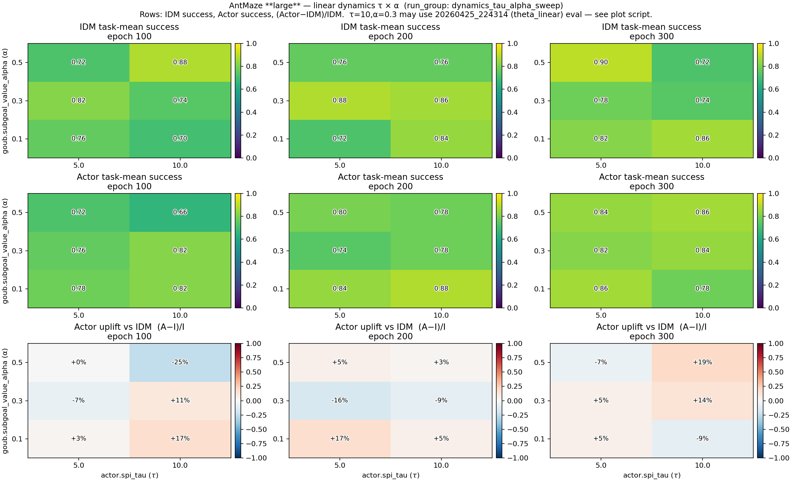
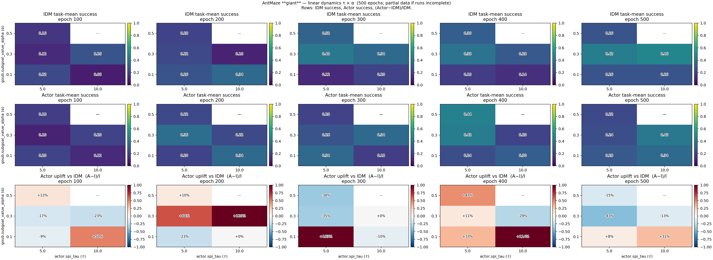

# Linear dynamics τ × α 스윕 요약 (2026-04-26)

`run_group: antmaze_navigate_dynamics_tau_alpha_sweep` — **linear-SDE dynamics** + DQC critic + SPI actor joint 학습.  
스윕 정의는 [`scripts/launch_dynamics_tau_alpha_sweep.sh`](../scripts/launch_dynamics_tau_alpha_sweep.sh) 와 동일한 YAML 순서를 기준으로 합니다.

## 히트맵 (eval 로그 기준)

아래 PNG는 각 run 디렉터리의 `run*.log`에 기록된 **`idm success_rate_mean` / `actor success_rate_mean`** 을 (α × τ) 격자에 올린 것입니다.  
세 번째 행은 **Actor 상대 이득** \((\mathrm{Actor}-\mathrm{IDM})/\mathrm{IDM}\) 입니다.

### AntMaze **large** (`antmaze-large-navigate-v0`, 300 epochs)



- **τ=10, α=0.3** large 셀: dynamics 스윕 런이 없으므로 히트맵 스크립트가 **`runs/20260425_224314_joint_dqc_seed0_antmaze-large-navigate-v0`** (theta_linear GOUB, 동일 env·τ·α)의 eval 로그로만 채웁니다.

### AntMaze **giant** (`antmaze-giant-navigate-v0`, 500 epochs)



- 위 PNG는 **`runs/`에 있는 모든 discount**를 섞어 격자를 채웁니다(동일 (τ, α)에 γ=0.99·0.995 런이 같이 있으면 디렉터리 정렬 순으로 나중 런이 덮어씀).  
- **γ = 0.99만** 고정한 스냅샷: [`dynamics_tau_alpha_sweep_giant_gamma099.md`](dynamics_tau_alpha_sweep_giant_gamma099.md) · [`figures/dynamics_tau_alpha_sweep_antmaze_giant_heatmaps_gamma0p99.png`](figures/dynamics_tau_alpha_sweep_antmaze_giant_heatmaps_gamma0p99.png)

## 표: 마지막 eval epoch 기준 (로그 파싱)

### Large — epoch **300**

| τ \\ α | 0.1 | 0.3 | 0.5 |
|--------|-----|-----|-----|
| **5**  | Actor **0.86** / IDM 0.82 | 0.82 / 0.78 | 0.84 / **0.90** |
| **10** | 0.78 / 0.86 | **0.84** / 0.74 (`224314`, theta_linear) | **0.86** / 0.72 |

Run 디렉터리: `runs/20260426_004705_*` (τ5α0.1), `090740` (τ10α0.1), `100435` (τ5α0.3), `110118` (τ5α0.5), `115828` (τ10α0.5). τ10α0.3 표·히트맵 값은 `20260425_224314_*` (epoch 300 eval).

### Giant — epoch **500** (γ = **0.99** 런만; 상세는 [gamma099 문서](dynamics_tau_alpha_sweep_giant_gamma099.md))

| τ \\ α | 0.1 | 0.3 | 0.5 |
|--------|-----|-----|-----|
| **5**  | 0.28 / 0.26 | 0.24 / 0.42 | 0.22 / 0.26 |
| **10** | 0.34 / 0.26 | 0.40 / 0.46 | *(τ10α0.5: `211335` epoch 500 eval 없음)* |

Run 매칭: τ5α0.1=`20260426_125527_*`, τ10α0.1=`143511_*`, τ5α0.3=`161442_*`, τ10α0.3=`175538_*`, τ5α0.5=`193448_*`. τ10α0.5는 `211335`가 epoch 500 eval 전에 끊김. **γ = 0.995** 재스윕 런은 이 표에 포함하지 않음.

## 히트맵 재생성

저장소 루트에서:

```bash
cd /path/to/douri
PYTHONPATH=. python scripts/plot_dynamics_tau_alpha_sweep_heatmaps.py
```

출력:

- `docs/figures/dynamics_tau_alpha_sweep_antmaze_large_heatmaps.png`
- `docs/figures/dynamics_tau_alpha_sweep_antmaze_giant_heatmaps.png`
- (선택) giant만 critic **γ=0.99** 필터:  
  `python scripts/plot_dynamics_tau_alpha_sweep_heatmaps.py --giant-discount-snapshot 0.99`  
  → `docs/figures/dynamics_tau_alpha_sweep_antmaze_giant_heatmaps_gamma0p99.png`

## 참고

- `antmaze_navigate_theta_linear_*` 는 기본적으로 이 스윕과 별개이나, **large τ=10·α=0.3** 격자 셀만 `224314` eval을 재사용합니다(히트맵 스크립트 주석 참고).  
- 재개 로그 `run_resume_from*.log` 도 히트맵 스크립트가 함께 읽습니다(동일 run 디렉터리에 있을 때).
