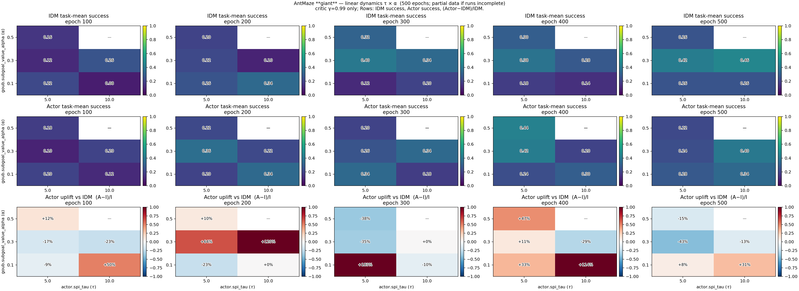

# Giant dynamics τ × α — **critic γ = 0.99** 스냅샷

`run_group: antmaze_navigate_dynamics_tau_alpha_sweep`, 환경 `antmaze-giant-navigate-v0`, **500 epochs**, YAML 상 `critic_agent.discount: 0.99` 인 런만 사용합니다.  
(이후 재스윕은 **γ = 0.995**; [`dynamics_tau_alpha_sweep_20260426.md`](dynamics_tau_alpha_sweep_20260426.md) 참고.)

## 히트맵 (epoch 100 … 500)



재생성:

```bash
cd /path/to/douri
PYTHONPATH=. python scripts/plot_dynamics_tau_alpha_sweep_heatmaps.py --giant-discount-snapshot 0.99
```

## 표: epoch **500** eval (Actor / IDM)

`run*.log`의 `idm success_rate_mean` / `actor success_rate_mean` (Actor 먼저 표기).

| τ \\ α | 0.1 | 0.3 | 0.5 |
|--------|-----|-----|-----|
| **5**  | 0.28 / 0.26 (`125527`) | 0.24 / 0.42 (`161442`) | 0.22 / 0.26 (`193448`) |
| **10** | 0.34 / 0.26 (`143511`) | 0.40 / 0.46 (`175538`) | *(미완: `211335` epoch 500 eval 없음)* |

- `211335` (τ10, α0.5): 로그가 epoch 90 부근에서 끊겨 **격자 마지막 셀은 히트맵에서 비어 있음**.
